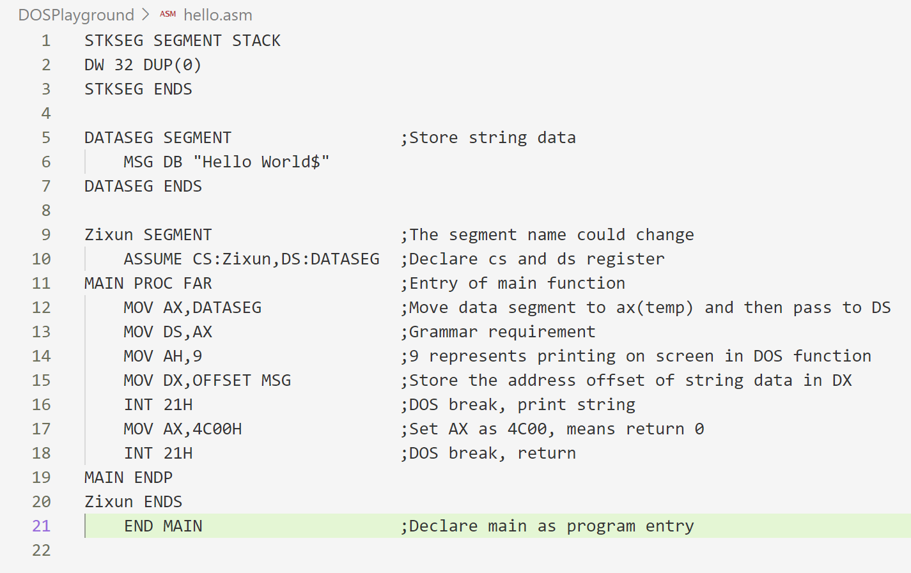
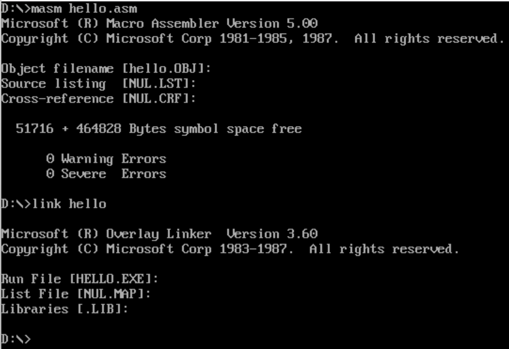
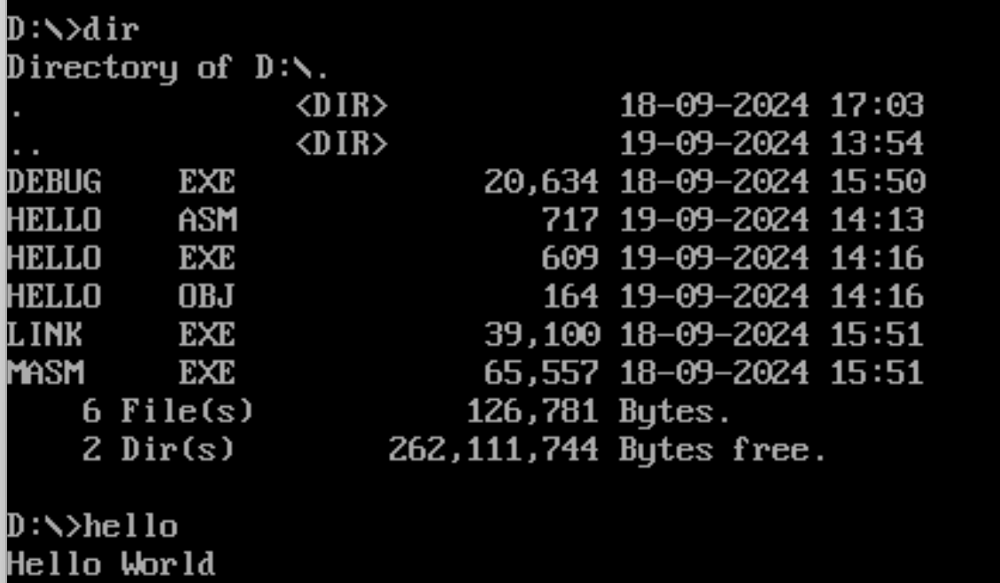
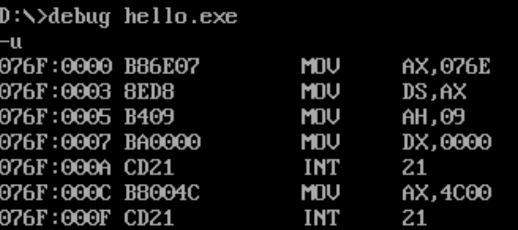
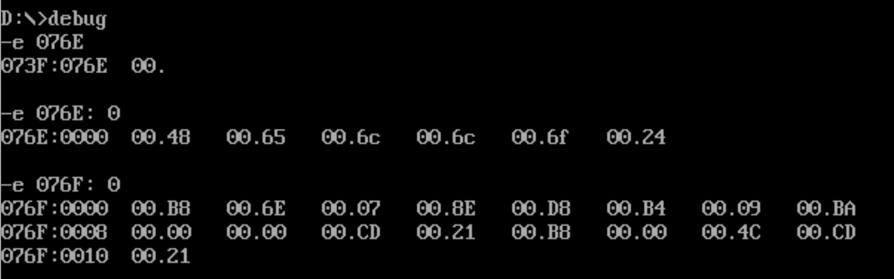
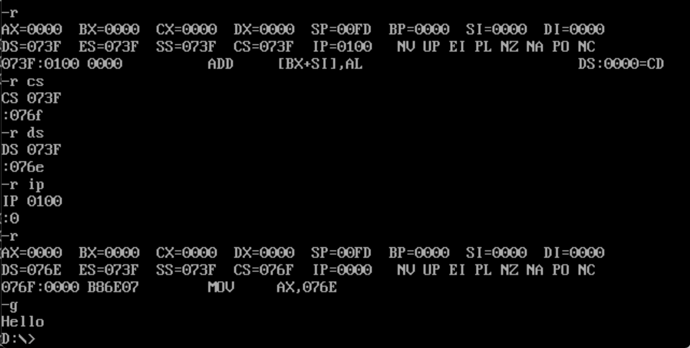

# Homework 1 Report

## 1 常规方式运行hello.exe

### 1.1 使用DosBox编译hello.asm

下图为hello.asm代码与我添加的注释，其中重点为DataSegment和CodeSegment，前者储存需要在屏幕中显示的字符串“Hello World”，后者储存代码片段。

下图为使用DosBox生成hello.exe

### 1.2 命令行运行生成的hello.exe

## 2 通过编辑内存与寄存器运行hello.exe

### 2.1 利用debug获取hello.exe的机器指令代码

根据汇编代码，我们可以获取以下信息：“Hello World”的字符串应储存在内存地址076E，并被移动到DS中；而机器指令代码储存在076F地址。

### 2.2 修改内存

首先，利用debug -e, 修改内存。从076E: 0开始将“Hello”填入，并从076F: 0开始将机器代码填入。

其次，利用debug -r，修改寄存器。将CS和DS设置为76f和76e（一一对应，和在hello.asm中声明的一致），并将ip调整为0，这样PC会默认从CS储存的地址开始执行代码。

最后，通过debug -g执行，可以看到Hello被打印到显示屏上，并正常退出。

