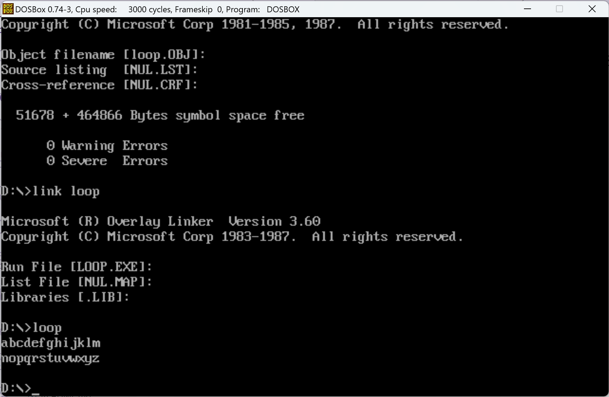
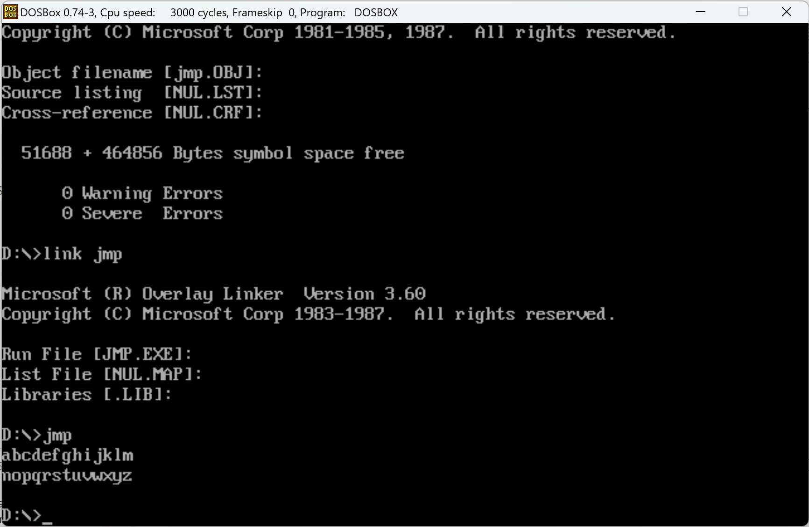
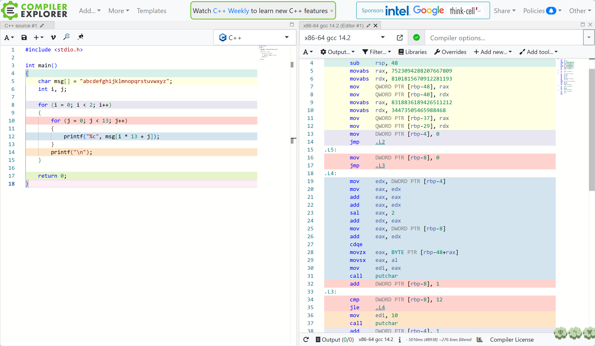

# HW2-Report

## 1.用双重循环打印字母表



如图所示为最终的打印结果，具体代码在DOSPlayground文件夹的loop.asm文件中。

### 遇到的一些问题

1. 对于这个作业，我首先分解问题，尝试单行逐个字符打印，即用一个循环打印26次。我一开始发现打印出来是乱码
2. 解决第一个问题后，我发现打印出来是26个大写的A。
3. 完成单行打印后，我发现想通过双层循环打印，CX需要恢复和保存，我一开始想用CX和BX分开管理，但没有效果。

### 解决方法

1. 我查阅了打印字符的代码是02H（不是字符串的9），另外寄存器应该不是DS。
2. 我发现我应该将字符从AL移动到DL中，才能正确打印出来；否则程序会尝试用未定义的值打印（0），打印出大写A。
3. 通过设置的栈堆段（STKSEG），pop和push指令实现CX的恢复和保存。

## 2.用条件跳转指令实现



如图所示为使用jmp条件跳转实现的结果，具体代码在DOSPlayground文件夹的jmp.asm文件中。

对比前一个方法，其实只需要改动loop指令，但实现循环的功能。换成将CX手动递减（即调用DEC CX），然后通过CMP将CX与0判断，最后利用JG进行条件判断，如果大于0则进行跳转。

## 观察C代码的反汇编结果



可以通过VSstudio或者gcc编译器对C代码编译生成exe可执行文件后利用objdump指令生成汇编代码；我这里直接使用了在线的反汇编工具，可以看到每一行C代码所对应的汇编代码。

### 添加注释

结果如下所示，我觉得比较有意思的是对于13这个乘数，编译器是通过拆分成加法和位偏移的方式实现的（3乘2乘2加1）。首先是两个寄存器互相叠加，然后添加偏移量（类似利用位运算符），最后一次相加，加速了运算。

```
main:
        push    rbp                       ; 保存旧的基址指针
        mov     rbp, rsp                  ; 设置新的基址指针
        sub     rsp, 48                   ; 为局部变量在栈上分配 48 字节空间

        ; 以下两条指令将一个64位常量存入 rax 寄存器
        movabs  rax, 7523094288207667809   ; 将 7523094288207667809 存入 rax
        movabs  rdx, 8101815670912281193   ; 将 8101815670912281193 存入 rdx
        ; 将 rax 和 rdx 中的值存入局部变量栈帧中的位置 [rbp-48] 和 [rbp-40]
        mov     QWORD PTR [rbp-48], rax    ; 将 rax 存入 [rbp-48]
        mov     QWORD PTR [rbp-40], rdx    ; 将 rdx 存入 [rbp-40]

        ; 重复相同的过程，存入其他值
        movabs  rax, 8318836189426511212   ; 将 8318836189426511212 存入 rax
        movabs  rdx, 34473505465988468     ; 将 34473505465988468 存入 rdx
        ; 将这些值分别存入 [rbp-37] 和 [rbp-29]
        mov     QWORD PTR [rbp-37], rax    ; 将 rax 存入 [rbp-37]
        mov     QWORD PTR [rbp-29], rdx    ; 将 rdx 存入 [rbp-29]

        ; 初始化局部变量 [rbp-4] 为 0
        mov     DWORD PTR [rbp-4], 0       ; 局部变量 i = 0
        jmp     .L2                        ; 跳转到外层循环的条件判断 .L2

.L5:
        ; 内层循环开始前，将局部变量 [rbp-8] 设为 0
        mov     DWORD PTR [rbp-8], 0       ; j = 0
        jmp     .L3                        ; 跳转到内层循环的条件判断 .L3

.L4:
        ; 获取 [rbp-4]，即外层循环变量 i，存入 edx
        mov     edx, DWORD PTR [rbp-4]     ; edx = i
        ; 将 i 复制到 eax，准备执行一些运算
        mov     eax, edx                   ; eax = i
        add     eax, eax                   ; eax = 2 * i
        add     eax, edx                   ; eax = 3 * i
        sal     eax, 2                     ; eax = eax << 2，相当于 eax = 12 * i
        add     edx, eax                   ; edx = 13 * i (计算偏移量)

        ; 从局部变量 [rbp-8] 获取内层循环变量 j，并加上偏移量 edx
        mov     eax, DWORD PTR [rbp-8]     ; eax = j
        add     eax, edx                   ; eax = j + 13 * i
        cdqe                              ; 将 eax 扩展为 64 位
        ; 从局部变量数组 [rbp-48+rax] 中获取字符
        movzx   eax, BYTE PTR [rbp-48+rax] ; 获取字符
        movsx   eax, al                    ; 将 al 扩展为有符号整数
        mov     edi, eax                   ; 将字符传递给 edi，准备输出
        call    putchar                    ; 调用 putchar 输出字符

        ; 内层循环变量 j += 1
        add     DWORD PTR [rbp-8], 1       ; j += 1

.L3:
        ; 判断内层循环是否结束 (j <= 12)
        cmp     DWORD PTR [rbp-8], 12      ; 比较 j 和 12
        jle     .L4                        ; 如果 j <= 12，跳转回 .L4

        ; 内层循环结束后，输出换行符
        mov     edi, 10                    ; 将换行符 '\n' 放入 edi
        call    putchar                    ; 调用 putchar 输出换行符

        ; 外层循环变量 i += 1
        add     DWORD PTR [rbp-4], 1       ; i += 1

.L2:
        ; 判断外层循环是否结束 (i <= 1)
        cmp     DWORD PTR [rbp-4], 1       ; 比较 i 和 1
        jle     .L5                        ; 如果 i <= 1，跳转回 .L5

        ; 程序结束，返回 0
        mov     eax, 0                     ; eax = 0，程序正常结束
        leave                              ; 恢复栈帧
        ret                                ; 返回

```
