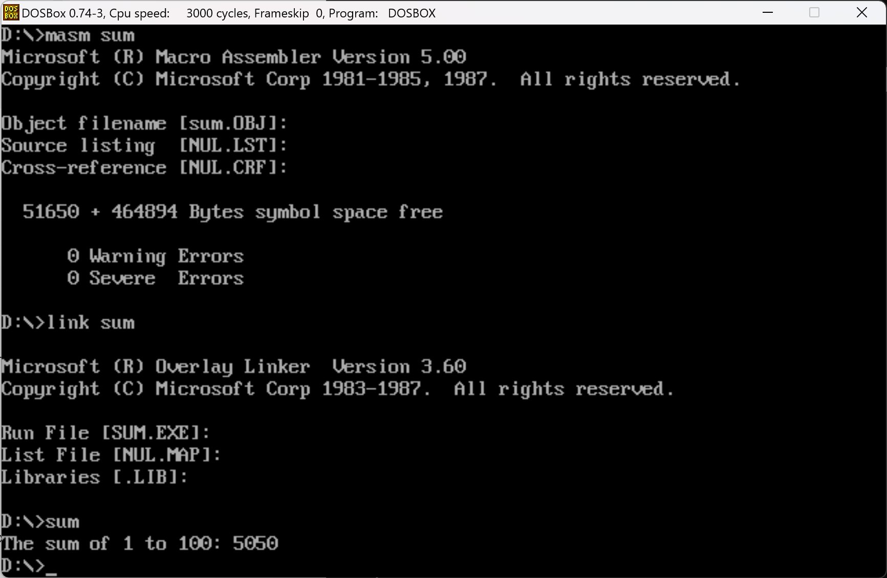
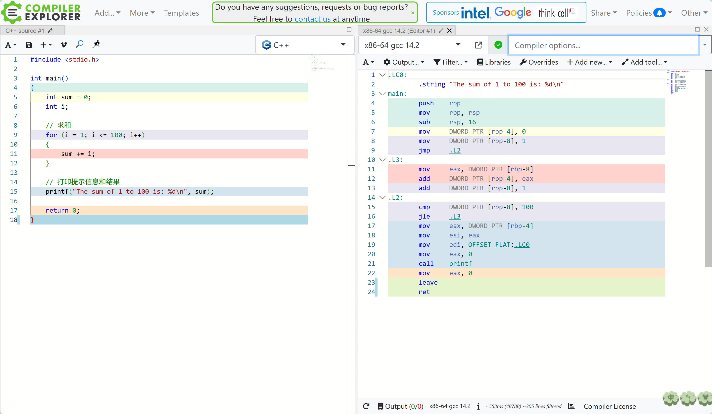

# HW3-数列求和

## 1.实现1到100的数列求和并打印

实验结果如图所示，具体代码在DOSPlayground的sum.asm中。

### 遇到的问题与解决方法

* 写99条指令直接将寄存器和100个不同整数相加显然是不太现实和高效的，因此我采取了循环的方式，让AX与CX相加，循环100次，（AX刚开始是0，CX从100开始递减至0）
* 得到结果后，将结果打印是一个重点，AX储存了二进制的整数结果，而打印所用的DX储存的是字符串的地址。我需要将二进制数转为字符串，再将这个字符串的位置储存在DX，最后打印出来。因此我创建了一个buffer用于储存字符串，再创建一个子程序来讲二进制数转化为十进制数，子程序的主要逻辑是将AX除10留商取余，不断将每一位数字拆分出来。

## 2.读取用户输入

在网上查询之后，我发现有三种读取用户输入的方式，分别是01H, 08H, 0AH。其中，第一第二个是读取字符，区别是有无屏显，类似C语言中的getch和getchar；第三个是读取字符串（实际是读取输入缓冲区），中间可以有空格，回车结束，类似于getline。

关于题目我觉得有两种处理方式，第一种是通过循环读取字符（1-100）就是最多三次循环，另一种是读取字符串。

我选择了第二种方式，分析如何利用缓冲区，第一个字节是缓冲区最大长度，第二个字节是读取的字符串的实际长度，剩下的是读取的字节。

在显示方面，可以通过02H循环打印字符，或者通过09H直接打印字符串。我分别写了两个文件，input.asm, input_revise.asm。

## 3.反汇编代码

分析汇编代码，假设rsp的初值是0x800，首先是保存rbp（rsp-4, 存入0x7fc），然后将rsp的值移动到rbp中，将rsp减去16（创造一个十六字节的栈空间，应该是16个字节的frame，即储存main函数的各种状态），然后在0x7f8填入sum（0），0x7f4填入i（1），然后进入到L2，在L2中，将i与100比较，如果比100少或相等，就进入L3，将i移动到eax，sum添加eax（i），i+=1；如果i比100大，则将sum移动到eax， 再移动到esi。先将字符串LC0的偏移量添加到di，然后打印字符串和esi的东西，将eax设为0（即返回值），最后退出返回main函数。
