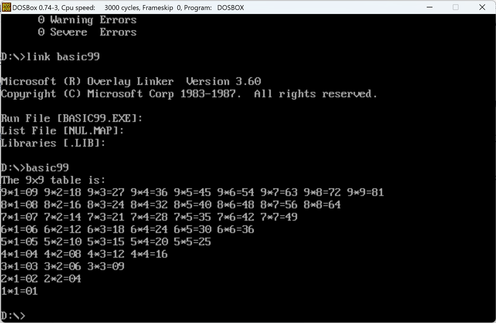
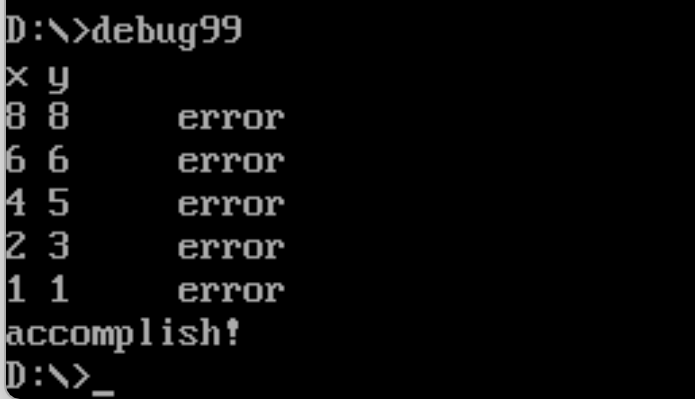

# HW4-report

1. ## 打印乘法表，利用过程调用。

   

   我创建了一个打印一行的功能函数PrintMul。然后main函数就调用一个print_line的循环来循环9次，每次call PrintMul（过程调用）和打印回车。

   其中的重点是如何打印数字。首先算出的结果是一位数或二位数，通过除法可以变成商和余数，变成两个单位整数，再填入到字符串的相应位置。而单个整数和打印出来字符的ASCII码的关系是相差48，即30H，所以要添加30H才能打印对应的整数。
2. ## 对于数据进行纠错，打印错误位置

   

   利用两层循环，row和col，从最后一个数，逐个往回检验；即从行9列9开始，到行9列8。重点是注意cx的push和pop
