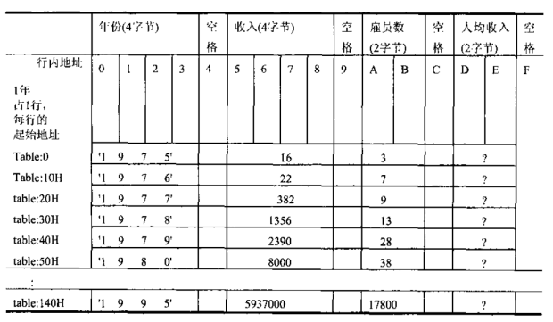
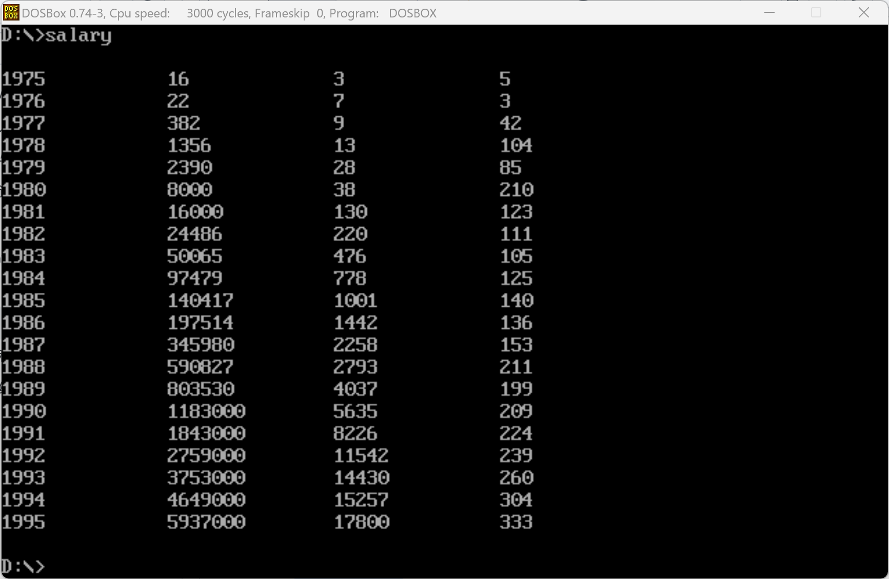

# HW5-report

## 1. 创建好三个汇编代码文件，将功能逻辑对应拆分



我将这个作业逻辑拆分成三部分，分别是main.asm存放工资数据段，创建table空间并调用其他模块，fill.asm计算工资并填入table，print.asm打印table内容。

其中，用EXTRN关键字（和C++的extern类似），声明使用的其他模块，如 `EXTRN fill_table:far`, 后面的far是标识这个函数在其他segment而不是当前segment；并在fill.asm中用PUBLIC关键字对应声明fill_table函数。

在功能逻辑上，我认为主要难点是将数字转换成ASCII码打印，这里我联想到之前的双重循环打印字母表，即通过除十取余加'0'，取商继续循环的方法，逐位将数字转化为其对应的ascii码。随后我使用了一个大小为15的中间栈用于储存转换后的字符串（15是打印后觉得比较美观），除了转化后的字符，其他空间为空格的ascii码。这样每次调用show_str函数就通过循环打印字符15次，将数字和空格都打印出来，并使排版美观。

## 2. 分别编译并用link连接到一起

```
masm main
masm fill
masm print
link main fill print

```

## 3.运行main.exe，观察打印结果


