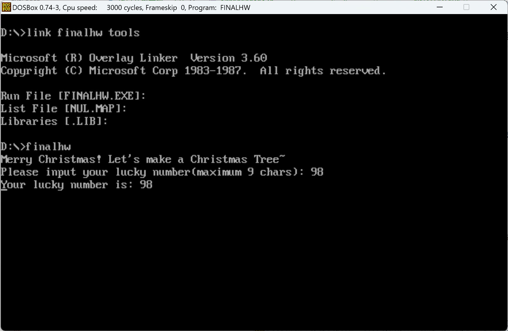
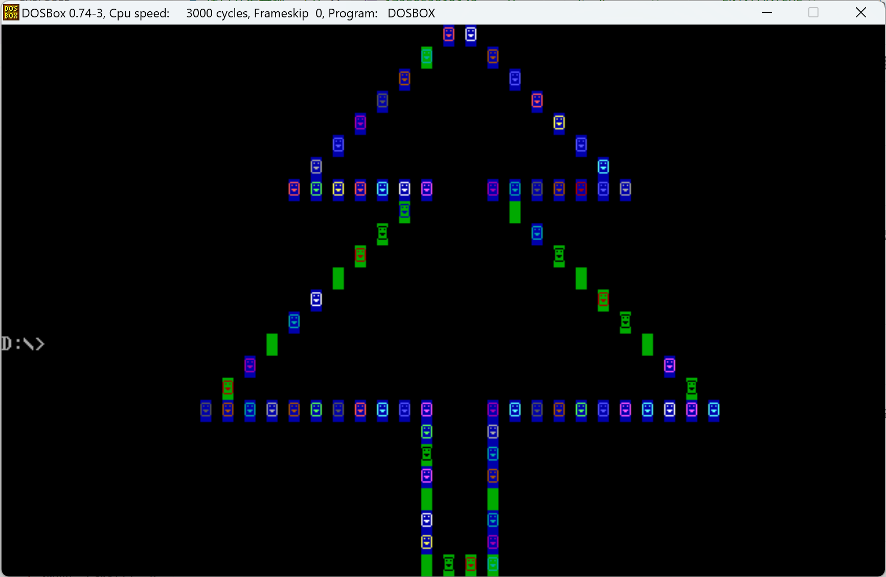
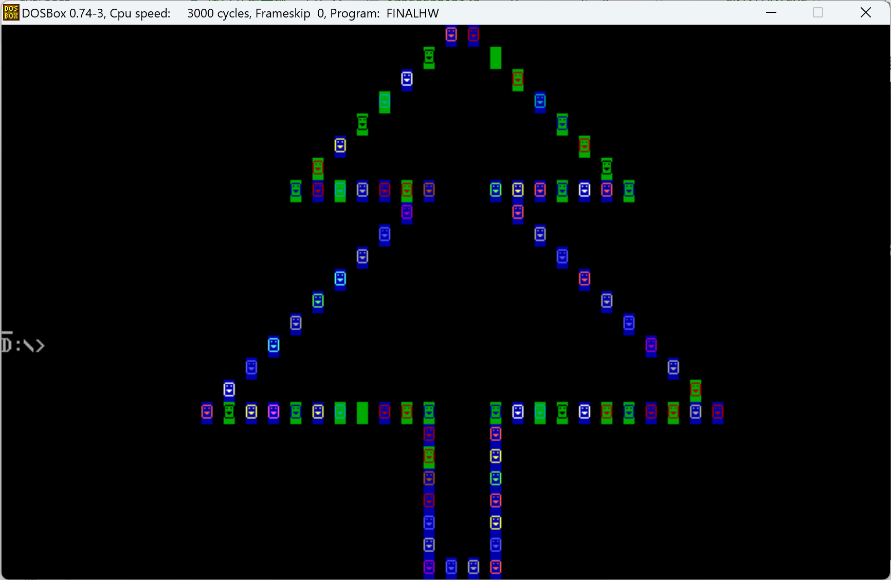

# 项目开发文档

## 1. 项目简介

Merry Christmas！这是一个圣诞树DIY小程序，可以让用户获得一颗独一无二的圣诞树。通过输入自己的幸运数字，结合随机数，每次生成的圣诞树都是不一样的图案。

## 2. 项目开发流程

开发这个项目时，我想到我应该将之前作业所学的内容都融合起来，比如从一开始的屏幕输出信息，到读取用户输入；从字符串转数字，到调用子程序，以及最后的多文件共同编译。

我首先是构建了项目的雏形，生成一颗圣诞树。通过将端口设为0b800h，我可以在屏幕中指定位置打印指定字符，然后设定好DATASEG，把树的框架画出来（每个字代表一个点，通过数值正负和大小来指引下一个点的移动）。

接着，我创建了菜单子程序，给出提示并读取用户输入；随后我在绘画子程序中将幸运数字字符串转为数字，并加上随机数，从而生成不同的图案。我还创建了另一个tools文件用于存放工具函数，如cls清屏，delay显示延迟等，使用户体验更好。

最后，我在主程序中调用各个子程序和工具函数，完成了这一项目。

## 3. 心得体会

这个项目的起源是我看到答辩日期正好是圣诞节，便想到：“那要不就做一个与之相关的项目吧”。

于是，我决定做一个圣诞树DIY项目，使用者可以输入自己的幸运数字，生成独属于自己的圣诞树。同时，为了加强独特性，我学习了随机数的生成方法，并运用到项目中，使圣诞树的图案更加特殊。

在开发过程中，我融会贯通了之前几次作业学习的知识，并且将许多作业的代码和逻辑复用到这次期末项目中，这种方法极大地提高了我的开发效率和准确度。

## 4.项目成果

